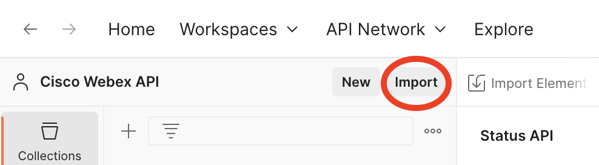
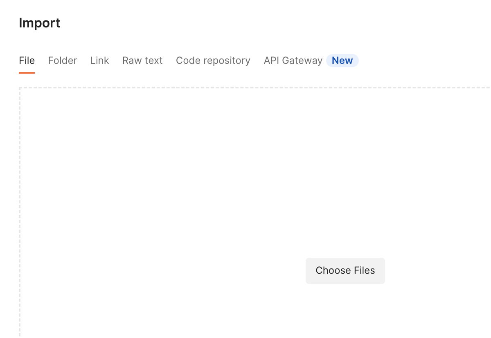
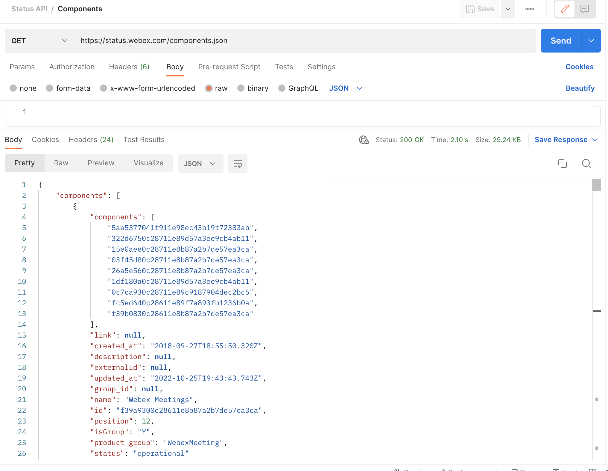

# Import and configure a collection 

## Not a Postman user yet ?

The tool comes with a free basic plan.

[Download](https://www.getpostman.com/) as a Chrome or Desktop application.

## How to import a collection into postman

Click on the Import button on the top left corner in your Postman, refer to the below screenshot for reference

Once you click on Import button, it should open a pop-up as shared in the below screen shot. You should stay on the "File" tab on the pop-up as shared in the screenshot below

Now, follow the below steps - 

- click over "Choose Files" option and browse to the exact Folder where you've clone this git repo
- select the JSON file "status-api-postman-collection.json" 
- Once you select the JSON file, it should show you the details of the Collection and you just need to hit on the "Import" button.

It's configured now and you should be all ready to explore the Status APIs under the recently imported Status API collection

## A sample Postman Request of the Status API

Please note, one doesn't need a valid Token to run these APIs. So, there is no requirement to set the environment variables for these APIs.
You can simply run the APIs from the imported collection. Just to show a sample here, please refer to the below screenshot where we've tested the "Components" API - 

